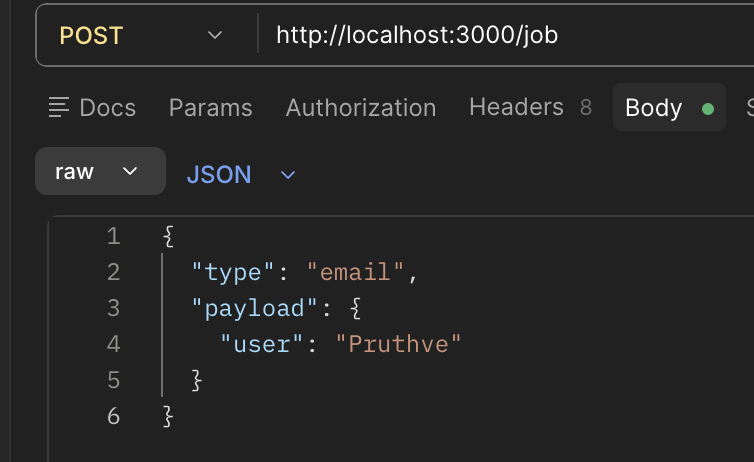
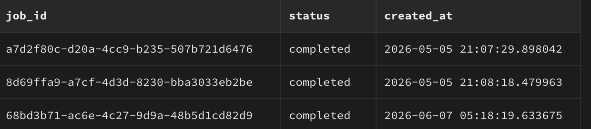
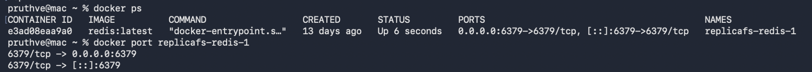
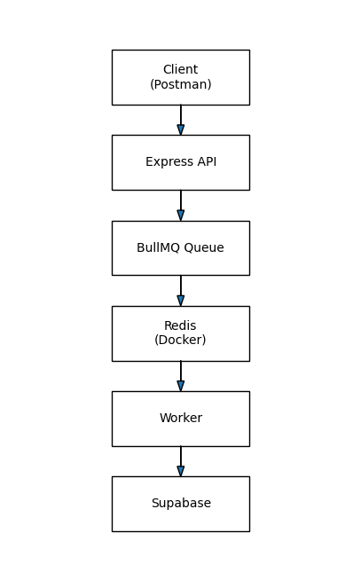

# TaskFlow

TaskFlow processes long-running operations in the background, reducing API response times and improving system scalability. This architecture is commonly used in production systems for email delivery, file processing, payment handling, and large-scale data workflows.


## Architecture

Client → Express API → BullMQ Queue → Redis → Worker → Supabase


## Features

* Asynchronous background job processing
* Redis-backed queue using BullMQ
* Worker-based task execution
* Retry handling with exponential backoff
* UUID-based job tracking
* Duplicate job prevention
* Persistent job status storage

## Key Concepts Demonstrated

* **Asynchronous Processing** – Jobs are executed in background workers without blocking API requests.
* **Queue-Based Architecture** – BullMQ and Redis decouple request handling from task execution.
* **Retry Mechanism** – Failed jobs are automatically retried using exponential backoff.
* **Idempotency** – Duplicate completed jobs are detected and skipped.
* **Job Status Tracking** – Job states (`processing`, `completed`, `failed`) are persisted in Supabase.
* **Containerization** – Redis is deployed and managed using Docker.


## Tech Stack

* Node.js
* Express.js
* BullMQ
* Redis
* Supabase
* Docker

## Setup

```bash
npm install

docker start replicafs-redis-1

node worker.js
node app.js
```

## API

### Create Job

POST /job

```json
{
  "type": "email",
  "payload": {
    "user": "Pruthve"
  }
}
```

## Screenshots

### API Request



### Worker Processing


### Job Status Table



### Redis Container



### Architecture

